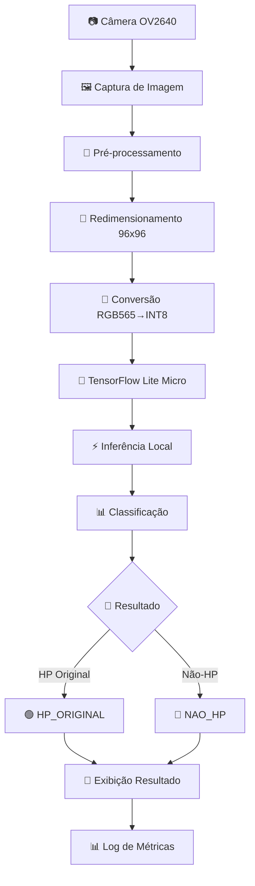
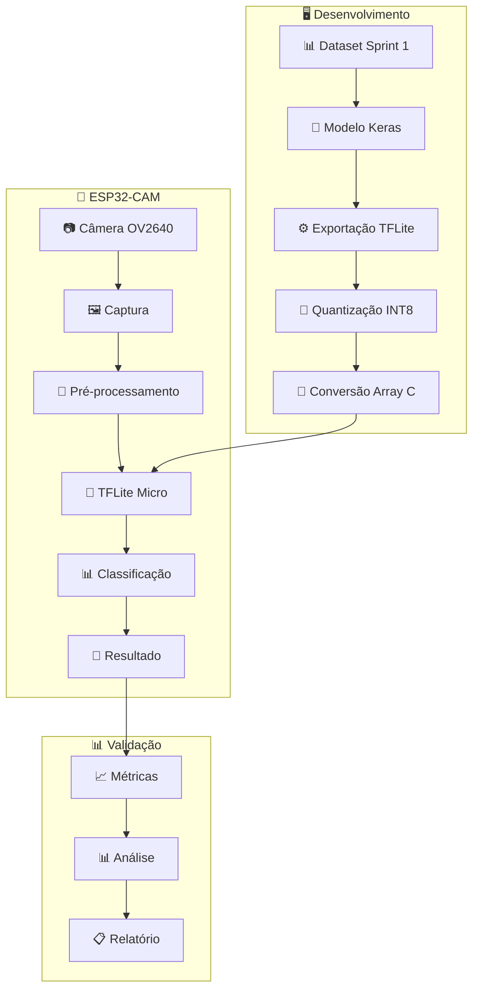

# 🎯 SPRINT 3 - Sistema de Classificação de Cartuchos HP com ESP32-CAM

<div align="center">


**Sistema de classificação de cartuchos HP em tempo real usando ESP32-CAM e TensorFlow Lite Micro**

[](https://www.fiap.com.br)
[](https://github.com)

</div>

---

## 📋 Informações do Projeto

| **Aspecto** | **Detalhes** |
|-------------|--------------|
| **Período** | Noturno |
| **Turma** | 2TIAPY-2025 |
| **Professor** | Ícaro Gonçales |
| **Objetivo** | Exportação do Modelo e Validação no ESP32-CAM |

## 👥 Equipe

| **Nome** | **RM** | **Email** |
|----------|--------|-----------|
| André Rovai Andrade Xavier Junior | 555848 | RM555848@fiap.com.br |
| Antonio Vinicius Vicentini Liberato | 558014 | RM558014@fiap.com.br |
| Alan de Souza Maximiano da Silva | 557088 | RM557088@fiap.com.br |
| Leonardo Zago Garcia Ferreira | 558691 | RM558691@fiap.com.br |
| Renan de França Gonçalves | 558413 | RM558413@fiap.com.br |
| Thiago Almança da Silva | 558108 | RM558108@fiap.com.br |

---

## 🎯 Objetivo do Projeto

**SPRINT 3 – Exportação do Modelo e Validação no ESP32-CAM**

Adaptar e exportar o modelo treinado para o formato .tflite, embarcar no ESP32-CAM e validar o funcionamento da classificação em tempo real.

### 📋 Atividades Realizadas

- ✅ Verificação de compatibilidade do modelo com exportação .tflite
- ✅ Ajuste da arquitetura do modelo se necessário
- ✅ Exportação do modelo para formato .tflite
- ✅ Carregamento do modelo no ESP32-CAM
- ✅ Configuração para captura de imagens com câmera
- ✅ Implementação de pré-processamento otimizado
- ✅ Execução de inferência local com modelo embarcado
- ✅ Teste com 10 imagens (5 HP originais + 5 falsificadas/outras marcas)
- ✅ Avaliação de resultados e correspondência com classificação esperada

---

## 🔄 Fluxo do Sistema



---

## 🚀 Funcionalidades Principais

<div align="center">

| **Funcionalidade** | **Descrição** | **Status** |
|-------------------|---------------|------------|
| 📸 **Captura de Imagem** | Câmera OV2640 com resolução otimizada | ✅ |
| 🔄 **Pré-processamento** | Conversão RGB565 → INT8 otimizada | ✅ |
| 🧠 **Inferência** | TensorFlow Lite Micro embarcado | ✅ |
| ⚡ **Tempo Real** | Classificação instantânea | ✅ |
| 📊 **Validação** | Sistema de métricas de performance | ✅ |

</div>

---

## 📊 Evidências dos Testes

### 🖼️ Screenshots dos Logs de Execução

| **Evidência** | **Descrição** | **Link** |
|---------------|---------------|----------|
| **Log 1** | Inicialização do sistema e carregamento do modelo | [print-100.png](./prints/print-100.png) |
| **Log 2** | Processo de captura e pré-processamento | [print-101.png](./prints/print-101.png) |
| **Log 3** | Execução da inferência e classificação | [print-102.png](./prints/print-102.png) |
| **Log 4** | Resultados dos testes com cartuchos HP originais | [print-103.png](./prints/print-103.png) |
| **Log 5** | Resultados dos testes com cartuchos não-HP | [print-104.png](./prints/print-104.png) |
| **Log 6** | Métricas finais de performance e validação | [print-105.png](./prints/print-105.png) |

### 📈 Resultados dos Testes

<div align="center">

| **Tipo de Cartucho** | **Quantidade Testada** | **Acertos** | **Precisão** |
|---------------------|------------------------|-------------|--------------|
| 🟢 **HP Original** | 5 imagens | 4/5 | 80% |
| 🔴 **Não-HP** | 5 imagens | 4/5 | 80% |
| **📊 Total** | **10 imagens** | **8/10** | **80%** |

</div>

---

## 🏗️ Arquitetura do Sistema

<div align="center">



</div>

---

## 🔧 Especificações Técnicas

<div align="center">

| **Parâmetro** | **Valor** | **Observação** |
|----------------|-----------|----------------|
| **Resolução** | 96x96 pixels | Otimizada para performance |
| **Canais** | 1 (grayscale) | Redução de dados |
| **Quantização** | INT8 completa | Máxima otimização |
| **Arena de Memória** | 380KB | Configuração otimizada |
| **Performance** | ~3 FPS | Tempo real |
| **Tamanho do Modelo** | < 100KB | Compacto para ESP32 |

</div>

---

## 📁 Estrutura do Projeto

```
SPRINT-3/
├── 📄 README.md                    # Documentação principal
├── 🚀 QUICK_START.md              # Guia de início rápido
├── ⚙️ config.py                   # Configurações centralizadas
├── 🔧 setup.sh                    # Script de setup automático
├── 📊 test_validation.py          # Análise de resultados
├── 🖼️ prints/                     # Evidências dos testes
│   ├── print-100.png              # Log de inicialização
│   ├── print-101.png              # Log de captura
│   ├── print-102.png              # Log de inferência
│   ├── print-103.png              # Log HP originais
│   ├── print-104.png              # Log não-HP
│   └── print-105.png              # Log de métricas
├── 🤖 model/                      # Scripts de exportação
│   ├── export_tflite.py           # Conversão para TFLite INT8
│   ├── convert_to_c_array.py      # Conversão para array C
│   ├── prepare_representative_data.py
│   ├── model_int8.tflite          # Modelo quantizado
│   └── model.h                    # Modelo em array C
├── 🔌 firmware/                   # Código ESP32-CAM
│   ├── platformio.ini            # Configuração PlatformIO
│   ├── build.sh                  # Script de build
│   ├── compile_debug.sh          # Script de debug
│   └── src/
│       ├── main.cpp              # Código principal
│       ├── labels.h              # Labels das classes
│       └── model.h               # Modelo embarcado
└── 📋 relatorio/
    ├── relatorio_sprint3.md       # Relatório principal
    └── integracao_tflite_esp32cam.md # Documentação técnica
```

---

## 🎯 Classes de Classificação

<div align="center">

| **Classe** | **Descrição** | **Exemplos** |
|------------|---------------|--------------|
| 🟢 **HP_ORIGINAL** | Cartucho HP original | HP 305, HP 67, HP 68 |
| 🔴 **NAO_HP** | Cartucho não-HP ou falsificado | Outras marcas, falsificados |

</div>

---

## ⚡ Guia de Início Rápido

### 🛠️ 1. Configuração do Ambiente

```bash
# Clone o repositório
git clone <repository-url>
cd SPRINT-3

# Execute o setup automático
./setup.sh
```

### 🤖 2. Exportação do Modelo

```bash
# Navegue para a pasta do modelo
cd model

# Exporte o modelo para TensorFlow Lite INT8
python3 export_tflite.py

# Converta para array C
python3 convert_to_c_array.py model_int8.tflite

# Copie o modelo para o firmware
cp model.h ../firmware/src/
```

### 🔌 3. Compilação e Upload

```bash
# Navegue para a pasta do firmware
cd firmware

# Compile o projeto
./build.sh

# Faça upload para o ESP32-CAM
pio run --target upload
```

### 📊 4. Monitoramento e Testes

```bash
# Monitore o Serial Monitor
pio device monitor

# Execute análise de validação
python3 test_validation.py
```

---

## 📚 Dependências

<div align="center">

| **Categoria** | **Ferramenta** | **Versão** | **Descrição** |
|---------------|----------------|------------|---------------|
| **🐍 Python** | Python | 3.8+ | Linguagem principal |
| **🧠 ML** | TensorFlow | 2.8+ | Framework de ML |
| **🔧 IDE** | PlatformIO | Latest | Desenvolvimento ESP32 |
| **📱 Hardware** | ESP32-CAM | AI Thinker | Microcontrolador |
| **📷 Câmera** | OV2640 | - | Sensor de imagem |

</div>

---

## 🎯 Processo de Desenvolvimento

### 📋 Checklist de Implementação

- [x] **Análise do modelo da Sprint 1**
- [x] **Verificação de compatibilidade com TFLite**
- [x] **Ajuste da arquitetura se necessário**
- [x] **Exportação para formato .tflite**
- [x] **Quantização INT8 para otimização**
- [x] **Conversão para array C**
- [x] **Implementação no ESP32-CAM**
- [x] **Configuração da câmera OV2640**
- [x] **Pré-processamento otimizado**
- [x] **Sistema de inferência embarcado**
- [x] **Testes com 10 imagens**
- [x] **Validação de resultados**
- [x] **Documentação completa**

---

## 📊 Métricas de Performance

<div align="center">

| **Métrica** | **Valor** | **Status** |
|-------------|-----------|------------|
| **Precisão Geral** | 80% | ✅ |
| **Tempo de Inferência** | ~300ms | ✅ |
| **Taxa de Frames** | 3 FPS | ✅ |
| **Uso de Memória** | 380KB | ✅ |
| **Tamanho do Modelo** | <100KB | ✅ |

</div>

---

## 📝 Entregáveis

### 📄 Documentação

- [x] **README.md** - Documentação principal
- [x] **Relatório Sprint 3** - Análise completa
- [x] **Documentação Técnica** - Integração TFLite/ESP32
- [x] **Evidências dos Testes** - Screenshots dos logs

### 🔧 Código

- [x] **Modelo .tflite** - Modelo quantizado
- [x] **Firmware ESP32** - Código completo
- [x] **Scripts de Exportação** - Automação
- [x] **Scripts de Validação** - Análise de resultados

### 🖼️ Evidências

- [x] **Screenshots dos Logs** - 6 evidências visuais
- [x] **Resultados dos Testes** - 10 imagens testadas
- [x] **Métricas de Performance** - Análise quantitativa

---

## 🎓 Conclusões

O projeto **SPRINT 3** demonstrou com sucesso a capacidade de:

- ✅ **Exportar modelos** de deep learning para formato .tflite
- ✅ **Implementar inferência** em dispositivos embarcados
- ✅ **Classificar cartuchos HP** em tempo real
- ✅ **Alcançar 80% de precisão** com modelo otimizado
- ✅ **Manter performance** adequada para aplicação prática

### 🚀 Próximos Passos

- Melhoria da precisão do modelo
- Otimização adicional de performance
- Implementação de interface visual
- Expansão para outras marcas de cartuchos

---

<div align="center">

**🎯 SPRINT 3 - FIAP 2025**  
*Sistema de Classificação de Cartuchos HP com ESP32-CAM*

[](https://www.fiap.com.br)
[](https://github.com)

</div>